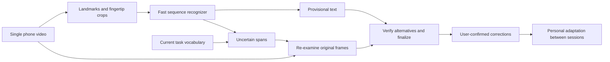

# Project review — 13 September 2026

The highest-upside next direction is a recognizer that combines fingertip video, hand motion and task context, then re-examines uncertain spans. The current results justify testing this; they do not establish that it will reach 100% automatic transcription.

This review covers the capture app, landmark/CTC pipeline, decoder v4, calibration ingestion, recorded results and relevant primary research. It is a code and evidence review, with a small normalization diagnostic. No models were trained, no new recording was made, and no benchmark was rerun. Existing code, models and frozen configurations were left unchanged.

**What the project has established**

The strongest measured improvement came from replacing discrete tap detection with sequence recognition, and then combining desk fine-tuning with the stronger decoder. Keep that foundation. The camera-to-text model currently consumes landmark coordinates; raw fingertip appearance does not reach its sequence encoder. See [the input loader](/Users/pashaalidadi/Documents/misc/computer-vision-test/phase0/analysis/seqctc.py:103) and [model](/Users/pashaalidadi/Documents/misc/computer-vision-test/phase0/analysis/seqctc.py:297).

The most recent full-decoder leave-one-session-out artifacts report:

| Session excluded from camera-model training | Reference words | WER | Reported words correct |
|---|---:|---:|---:|
| Old desk session | 137 | 10.2% | 89.8% |
| First free-phrase test | 62 | 11.3% | 88.7% |
| Second free-phrase test | 51 | 21.6% | 78.4% |

Sources: `data/sessions/zz-v4loso-<session>/decipher2_v3_recommended.json`. Across these artifacts there are 32 word edits in 250 reference words. The visual models exclude each session, but the decoder was developed using these texts. This is development evidence, not a clean estimate for a future untouched session. It also differs from same-session phrase-fold CV, which produced the widely quoted 94% result.

Decoder v4 reduced the earlier development comparison from 27 to 25 word edits, with no improvement on the second free-phrase session. Its 318-second dry run for 120 seconds of video shows that interactive latency remains a separate major problem. See [v4 results](/Users/pashaalidadi/Documents/misc/computer-vision-test/results/v4/SUMMARY.md).

**1. The main research bet: put the pixels back into sequence recognition**

Use two synchronized inputs: the existing landmark sequence, and small temporal crops of both hands/fingertips. Landmarks describe approximate geometry. Crops can retain silhouette, contact appearance and motion that the landmark estimate discarded. Fuse their features before predicting the character sequence; do not require a tap detector to choose every character boundary first.

There is unusually relevant evidence inside this repository: the earlier tap-based study improved keyboard key identification from about 37% with pose to 45% with pixels and 50% with fusion. Hand-mask controls argued against simply reading keyboard legends. See [the earlier pixel study](/Users/pashaalidadi/Documents/misc/computer-vision-test/REPORT.md:429). This does **not** prove a gain over today's much stronger CTC model, and raw-pixel fusion is not a wholly untried idea here. The untested extension is using it throughout continuous sequence recognition instead of only at detected contacts.

Start with a modest crop encoder and temporal fusion head, retaining the existing landmark model. Compare masked-hand RGB, silhouette and landmark-only conditions. Use my synchronized keyboard recordings for supervision and desk phrases for adaptation. Test a frozen pretrained visual encoder against a small encoder trained on these crops; the repository's failed public-footage transfer is a reason to measure domain transfer, not assume it works. Avoid training a large video model from scratch on 31 phrases.

RGB/keypoint fusion has worked in sign-language recognition, which supplies an architectural precedent rather than a typing-accuracy forecast. [Two-Stream Network, NeurIPS 2022](https://arxiv.org/abs/2211.01367).

**2. Use context to search the evidence, then to re-examine it**

The current decoder already has a personal lexicon, a word trie, fuzzy candidates and LLM rescoring. Recommending another generic lexicon beam would repeat completed work.

A useful additional experiment is local CTC word spotting: search frame probabilities directly for a small set of relevant terms, even when those terms never survive the full-sentence beam. Retrieve terms from the current document, project or conversation, with an ordinary spelling path retained. For example, coding context can supply identifiers; an email draft can supply recipient names. Add detected terms as alternatives with their frame spans and compare them with the existing hypothesis, rather than inserting them solely because they are contextually plausible.

CTC-based Word Spotter uses this kind of compact context graph in speech recognition. Transferring it to visual CTC is a hypothesis we can test with existing posterior files, without recording more video or training a bigger LLM. [Andrusenko et al., Interspeech 2024](https://arxiv.org/abs/2406.07096).

The more ambitious extension is **context-guided visual reinspection**. When candidate spellings disagree, send the corresponding original video interval to a stronger crop encoder or a learned candidate-comparison head. Train that head on real confusions from training recordings, including plausible but wrong words. Context proposes alternatives; the visual signal must distinguish them. Compare this against random-span reinspection and context-free reinspection to establish whether the extra mechanism helps.

Some reports conclude that words absent from the candidate pool can only be recovered by better camera evidence. That is too strong: absence proves a limit of the tested candidate generator, not absence of information in the original frames or posteriors. The swipe diagnostic itself found some true strings with higher CTC likelihood than the chosen output. Conversely, a correct word in the pool is only an oracle opportunity; it does not prove a practical selector can choose it.

**3. Fix the text representation before expanding calibration**

The camera symbol set is `a–z`, space, blank and an undifferentiated OTHER symbol. The shared normalizer removes digits, accented letters and most punctuation. A direct diagnostic of [that function](/Users/pashaalidadi/Documents/misc/computer-vision-test/phase0/analysis/decipher.py:188) produced:

| Input | Normalized output |
|---|---|
| `get2germany` | `getgermany` |
| `für morgen` | `fr morgen` |
| `x = 2;` | `x` |

Yet [the calibration protocol](/Users/pashaalidadi/Documents/misc/computer-vision-test/phase0/CALIB_PROTOCOL.txt:42) explicitly asks for the digit in `get2germany`. A multilingual LLM cannot repair the absence of distinct visual labels for these symbols reliably. Current scores also do not test their faithful preservation.

Define the supported text first, then extend the visual alphabet and training labels to digits, relevant German characters, punctuation and necessary editing actions. Preserve a literal path for names and code. Keep separate measurements for exact transcription and any optional correction of the user's own mistakes. Retain the old normalized metric only for historical comparisons; add a literal metric so lost symbols cannot disappear from evaluation.

**4. Make calibration informative and independently checked**

The current ingest filter uses the model being improved to decide whether a prompted phrase was typed correctly. Its own diagnostic accepts 48% of references with one word removed and 29% with one word swapped. These are synthetic reference perturbations, not measured real typing-error detection rates, but they refute the protocol's promise that mistyped phrases will reliably be dropped. It can also reject difficult correct examples. The `cut_at_end` flag is recorded but is not itself part of the acceptance rule. See [ingestion](/Users/pashaalidadi/Documents/misc/computer-vision-test/phase0/analysis/calib_ingest.py:73) and `.cache/ctc_v4/README.json`.

Use model alignment as a quality flag, not ground truth. Let the user mark a slip or unfinished phrase, retain uncertain clips for review, and avoid declaring all accepted prompts error-free. Bare-desk video cannot independently reveal every intended or accidental character.

For roughly the same recording budget as the proposed 201 prompts, collect several shorter sessions with realistic phone remounts and posture changes. Select examples that cover confused letter transitions, repeated letters, spaces, names and mixed-language text, alongside ordinary sentences. Compare this curriculum with frequency-based prompts at equal minutes of user effort. The same-session learning curve flattening near 12 phrases does not show that 12 phrases cover different setups.

**5. Build an interactive recognizer alongside the accuracy work**

The current encoder uses future frames, and normalization uses statistics from the session. Running the batch pipeline more frequently will not by itself produce a faithful streaming implementation.

Train a causal or bounded-lookahead student from the existing offline teacher, use rolling normalization, and decode incrementally. Show provisional text quickly; reserve the expensive LLM and visual reinspection for uncertain intervals. Measure first-text latency, finalization latency and disruptive revisions separately.

A correction gesture can select a span, choose an alternative or enter a literal correction. Those confirmed corrections become valuable training pairs. Candidate-bar oracle numbers are not a usability result: measure actual correction effort and final text accuracy. This preserves the user's automatic-accuracy goal while also producing a useful interface during development.

**The next experiments, in order**

| Experiment | What changes | Decision evidence |
|---|---|---|
| Alphabet and calibration audit | Label/normalization contract; reviewed calibration status | Digits/German text preserved; measured mistaken-label acceptance and correct-label rejection |
| Local context word spotting | Additional span candidates from existing CTC probabilities | Actual WER and name recall improve without excessive false contextual substitutions; not just a better oracle |
| Continuous RGB + landmark fusion | Visual sequence features; same decoder and data split | Lower error across held-out sessions and with a weak/fixed decoder, showing added visual information |
| Context-guided reinspection | Stronger processing only on ambiguous video spans | Gain over both extra-compute and context-only controls at an explicit latency budget |
| Adaptive calibration | More informative, diverse examples | Better fresh-session accuracy per minute of recording than the current prompt list |

Choose configurations on development sessions, then freeze model weights, decoder/search settings, text normalization and the context source/snapshot policy before new tests. Evaluate several genuinely new sessions, including remounts, names and mixed-language text; a practical next pilot is 500–1,000 words spread across sessions. That is a pilot, not a statistical guarantee. Report errors by session and by substitutions/deletions/insertions, literal-symbol accuracy, exact-name accuracy, correction effort and latency. Keep the original blind-2 result as historical evidence; it is training/development data now.

Maintain one small, versioned inference package and one authoritative result index. The current root README still describes a scaffolding project while deployment code and important manifests live in ignored `.cache` paths. Content-address the inference artifacts and record exactly which data each model and decoder saw. This will prevent incompatible caches and old summaries from being mistaken for the current product.

**Where a breakthrough could come from**

Single-camera surface typing already has direct prior art: TypeNet introduced a single-camera approach and the TypingHands26 dataset. Dataset access and suitability would need checking before a transfer experiment. It is not evidence that another public model will transfer to this rig. [TypeNet, WACV 2022](https://openaccess.thecvf.com/content/WACV2022/html/Maman_Typenet_Towards_Camera_Enabled_Touch_Typing_on_Flat_Surfaces_Through_WACV_2022_paper.html).

The distinctive research direction here is a low-calibration, personal visual recognizer that uses task context to direct additional perception and learns from verified corrections, all with the existing single phone camera. The components have precedents; their effectiveness together on bare-desk typing is unproven. I would invest first in the output/label fixes and the two visual/search experiments above. Another unrestricted LLM size increase, another tap-path sweep, or a claim of a physical accuracy ceiling is not supported as the next best use of effort by the current evidence.
